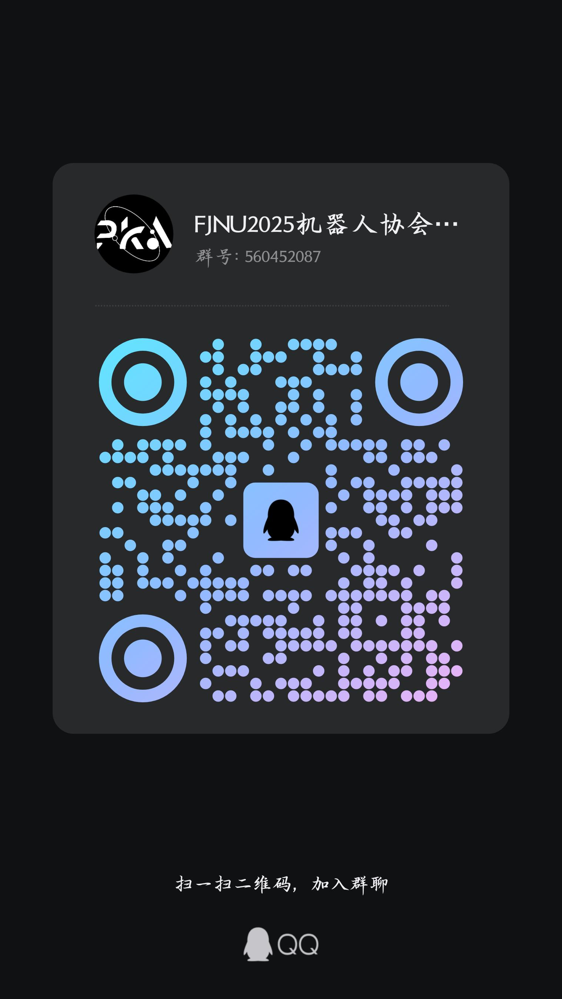

# 机器人协会

## 介绍

“成为工程师，从踏入赛场开始。”

如果你渴望在科技浪潮中崭露头角，福建师范大学机器人协会正为你敞开大门————

这里是光电与信息工程学院旗下的学术科技类社团，更是技术热爱者的实战舞台！

* 我们的**核心战场**：**全国大学生机器人大赛 - RoboMaster 机甲大师赛**
    - 七大兵种机器人设计
    - 机械设计 + 电控开发 + 视觉算法多学科协作

* 我们的**战队战绩**：**福建师范大学PKA战队（原Pikachu战队）**
    - 2025/2024赛季连续斩获高校联盟赛（福建站）季军
    - 2024赛季超级对抗赛南部赛区32强

* **部分比赛证书**

## 关于迎新

**机器人协会欢迎任何热爱Robomaster赛事与喜欢机器人技术的同学加入我们！**

2025届QQ迎新群: **560452087**

2025年协会介绍文档：[福建师范大学机器人协会介绍&FAQ 2025](https://www.kdocs.cn/l/ciTbuJ3DoNtf)

## 相关链接

[**B站账号【福师大机器人协会】**](https://space.bilibili.com/2084906333?spm_id_from=333.337.search-card.all.click)

[**Robomaster比赛官网**](https://www.robomaster.com/zh-CN)

[**Robomaster官方B站账号**](https://space.bilibili.com/20554233?spm_id_from=333.337.0.0)

**部分比赛视频**

[2025赛季高校联盟赛 福建站 合集](https://www.bilibili.com/video/BV1DsXYYJE4Q?spm_id_from=333.788.videopod.sections&vd_source=81dc23c30ec004cf560d903f1e986d2f)

第60场 佛山大学 醒狮战队 vs 福建师范大学 Pikachu战队

第56场 福建师范大学 Pikachu战队 vs 福建农林大学 零七一战队

第50场 厦门理工学院 PFA战队 vs 福建师范大学 Pikachu战队

第40场 福建师范大学 Pikachu战队 vs 北京理工大学珠海学院 毅恒战队

第26场 深圳技术大学 悍匠战队 vs 福建师范大学 Pikachu战队

[2024赛季超级对抗赛 南部赛区 合集](https://www.bilibili.com/video/BV1Qn4y1R7Ee/?spm_id_from=333.337.search-card.all.click&vd_source=81dc23c30ec004cf560d903f1e986d2f)

第10场 福建师范大学 Pikachu 战队 vs 北京信息科技大学 星辰 战队

第32场 福建师范大学 Pikachu 战队 vs 南京航空航天大学 长空御风 战队

**宣传视频**

[【RoboMaster官方开源分享】工程机器人自定义控制器展示](https://www.bilibili.com/video/BV1pN4y1n7xf/?spm_id_from=333.1387.search.video_card.click&vd_source=81dc23c30ec004cf560d903f1e986d2f)

[【25赛季联盟赛宣传视频】 《【RM】联盟赛福建站季录》](https://www.bilibili.com/video/BV13aZPYDEym/?spm_id_from=333.1387.homepage.video_card.click&vd_source=81dc23c30ec004cf560d903f1e986d2f)

[【24赛季总结】 《RM2024 | 福建师范大学Pikachu战队赛季纪录片》](https://www.bilibili.com/video/BV1pMt2ewEP9/?spm_id_from=333.1387.upload.video_card.click&vd_source=81dc23c30ec004cf560d903f1e986d2f)
