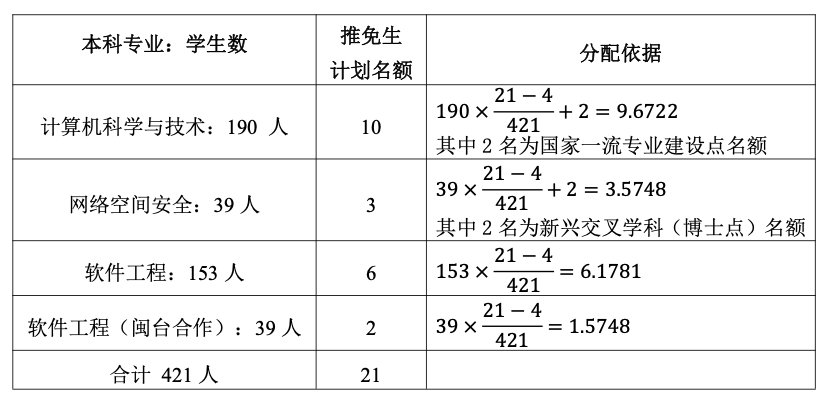

# 计算机与网络空间安全学院详情

[学院官网地址](https://ccs.fjnu.edu.cn/main.htm)

!!! quote "提示"
    本文主要由学长 [@Coredump](https://github.com/nevermind-bit) [@炳源](https://github.com/BY-H) 贡献。

对于各位进入 FJNU 计网学院的各位同学，其实大多还是对计算机行业还是不明就里的进来了，对于计算机行业的认知也难以做到透彻，本文档的目的就是尽量减少各位在计算机学习中的各种**信息差**，希望各位能够多少多一点信息获取的渠道，以及能够在正式开始未来大学四年的学习之前，能够稍微锻炼一下自己的计算机相关能力，为自己找到更好的前途方向。

## 零基础入门计算机专业

> 暂时想到这些，欢迎补充👏

- 了解下计算机硬件组成和作用（CPU / 内存 / HDD / SSD / 显卡 / 输入输出设备）
- 计算机常用快捷键与基础操作（资源管理很重要）：掌握文件管理基础，理解文件与文件夹的概念，绝对路径 / 相对路径，快捷方式，常用快捷键（复制 / 粘贴 / 撤销 / 恢复 / 切换窗口 / 打开资源管理器 ...），常用文件操作 ...
- 感兴趣可以研究下[如何动手安装一台自己的计算机](https://space.bilibili.com/14871346/lists/351804?type=season)（[@硬件茶谈](https://space.bilibili.com/14871346)）
- 接下来拿 C/C++ 编程语言入门（Python 作为效率工具或 AI 方向的基石），至于未来的编程语言选型，可根据各自语言的特性和应用领域做抉择（C++/Go/Rust/Java/JavaScript ...）
- 如何科学上网（访问外网）：[此链接](https://www.scxzyjc.com/)出现在这里纯属二进制 bit 的随意组合，与本人毫无关系
- 墙裂推荐 MIT 经典课程「[计算机教育中缺失的一课](https://missing-semester-cn.github.io/)」或者上交 IPADS 实验室的「[新人培训](https://space.bilibili.com/1085720801/lists/78079?type=season)」入门计算机常见的工具
- 掌握好数据结构与算法、操作系统和计算机网络等专业课程，更加体系的计算机学习路线可自行搜索，发挥你的主观能动性
- [学会如何提问](https://github.com/ryanhanwu/How-To-Ask-Questions-The-Smart-Way/blob/main/README-zh_CN.md)：提出一个好的问题已经解决了问题的 90%，如果还是不懂如何咨询他人/提问，可参考 [StackOverflow](https://stackoverflow.com/questions) 的提问方式
- 前期可加入技术社区，后期试着动手搭建个人博客（服务器选型 / 域名 / 图床 / 备案 ...），养成写博客的习惯，用输出倒逼输入
- 大学期间，尽快明确未来读研还是就业，很大程度上决定了你未来的学习方向
    - 读研：找一位你感兴趣的老师，跟进他/她的课题，争取做出一些科研成果，有利于未来保研/读研
    - 就业：选好自己的技术栈，多做项目，多多实习

- ...

## 关于自学

提升自学能力：

- 搜集信息的能力：搜索引擎推荐使用 [Google](https://google.com) 或 [Bing](http://bing.com/)（不要过度依赖大模型）
- 甄别能力：学会找交集，多思考，多交流，再不济可以用大模型汇总
- 输出倒逼输入：多写博客，推荐掌握 Markdown 所见即所得
- 提升英语水平：有助于快速获取/阅读国内外一手官方文档，而非他人蒸馏过的博客

自学好处：

- 自学最大的好处就在于可以完全根据自己的进度来调整学习速度。对于一些疑难知识点，我可以反复回看视频，在网上谷歌相关的内容，上 StackOverflow 提问题，直到完全将它弄明白。而对于自己掌握得相对较快的内容，则可以两倍速甚至三倍速略过。
- 自学的另一大好处就是博采众长。计算机系的几大核心课程：体系、网络、操统、编译，每一门我基本都上过不同大学的课程，不同的教材、不同的知识点侧重、不同的 project 将会极大丰富你的视野，也会让你理解错误的一些内容得到及时纠正。
- 自学的第三个好处是时间自由。大学的课余时间本就相对自由，再加上不用去上课的话更是可以放飞自我地安排自学时间和进度。我大二的时候赶上疫情在家窝了大半年，返校之后也基本没有线下去过教室上课，对绩点也毫无影响。

当然，作为 CS 自学主义的忠实拥趸，我不得不承认自学也有它的坏处。

- 第一就是交流沟通的不便。我其实是一个很热衷于提问的人，对于所有没有弄明白的点，我都喜欢穷追到底。但当你面对着屏幕听到老师讲了一个你没明白的知识点的时候，你无法顺着网线到另一端向老师问个明白。我努力通过独立思考和善用 Google 来缓解这一点，但是，如果能有几个志同道合的伙伴结伴自学，那将是极好的。
- 第二就是这些自学的课程基本都是英文的。从视频到课件再到作业全是英文，所以有一定的门槛。不过我觉得这是个值得努力克服的挑战，因为在当下，虽然我很不情愿，但也不得不承认，在计算机领域，很多优质的文档、论坛、网站都是英文居多。养成英文阅读的习惯，在赤旗插遍世界之前，还是有一定好处的（狗头保命）。
- 第三，也是我觉得最困难的一点，就是自律。因为没有 ddl 有时候真的是一件可怕的事情。特别是随着学习的深入，国外的很多课程是相当虐的。你得有足够的驱动力强迫自己静下心来，阅读几十页的 Project Handout，理解上千行的代码框架，忍受数个小时的 debug 时光。而这一切，没有学分，没有绩点，没有老师，没有同学，只有一个信念 —— 你在变强。

## 算法 / 编程竞赛

> 可以加入 **FJNU2025 级 ACM/ICPC 迎新群 958428489** 进行学习，提问也可以在这个群提问，一般大家看到了都会回。

推荐网站：

- [OI-Wiki](https://oi-wiki.org/)
- [LeetCode](https://leetcode.cn/discuss/post/3141566/ru-he-ke-xue-shua-ti-by-endlesscheng-q3yd/)
- [Codeforces](https://codeforces.com/)

推荐书籍：

1. 《算法第四版》：适合初学者入门
2. 《大话数据结构》&《算法图解》：这两本书的特点是有趣、易理解，也非常适合初学者
3. 《算法导论》：特点是全面，它是一本算法的百科全书，着重在于开阔算法视野，适合有一定算法基础后再去学习

## 实用大模型应用

现在这两年 AI 发展挺迅速的，所以 AI 的使用我觉得也是计算机系专业必备的一个技能，GPT 或者是其他的都可以使用，但鉴于国内访问的困难，如果不会科学上网的话，我推荐几个常用的 AI 工具（大模型应用），大家挑趁手的用即可：

- [DeepSeek](https://chat.deepseek.com/)
- [Kimi.ai - 帮你看更大的世界](https://kimi.moonshot.cn/)
- [秘塔 AI 搜索](https://metaso.cn/)
- [通义千问](https://www.tongyi.com/)

这几个算是我用到得比较多的，或者是说，在学习了 Python 或者其他之后，也可以尝试自己搭一个自己的本地 AI，使用 Ollama 搭建本地 AI 已经非常便捷了。

## 关于学院细分专业与开设课程

✅ 其实贵校的挺多课程，都一言难尽的，我的建议是课堂能不听就不听，保持自学的动力，才能让你进步更快。

### 计算机科学与技术

计算机科学领域最先关注的是科学理论。该专业的学生需要对数学和信息科学的理论基础有深入的了解，可以研究复杂的算法并推进科学研究。他们通过明确的定义概念、严谨的分析和实验，进而总结和证明研究成果。

计算机科学非常注重研究离散数学、算法、数据结构、数据库理论、编程语言、编译器设计、计算机体系结构等内容，理论程度很高，所以如果需要将理论与现实问题结合起来则需要付出更多的努力。

### 软件工程

或许大多数人对于计算机相关专业领域的理解更接近软件工程。软件工程，即在高度变化的市场和现实环境中开发出最易于使用的软件，进而解决现实中遇到的复杂问题。

软件工程通常被认为是比计算机科学更少理论更多实践的专业。虽然仍需要学习一定的数学知识，但在软件工程项目里，你将花更多的时间来练习编程这样的实务技巧，以便未来使用技术解决现实问题。

有些学校在软件工程项目的时间设置上要比计算机科学项目长一些。一些软件工程的论文需要更长的软件开发周期。软件工程的课程可能会涉及诸如需求收集、大型团队协作项目等内容。因此对于软件工程师来说，技术是一方面的能力，团队协作与沟通也是必不可少的能力。

### 网络安全

推荐阅读：https://ctf-wiki.org/

网安可以看看你们的培养计划。除了 408（即数据结构与算法，计算机组成原理，操作系统和计算机网络）之外，我们还学 python，java，网络安全数学基础（这个挺难）和密码学，网络安全原理这几门专业必修。那网安究竟做什么呢？在福建省内若想以本科生身份寻求网安相关的就业岗位，大部分会成为运维岗或者安全服务工程师。若想成为安全研究员或进各类实验室则需放眼省外。那网安专业建议工作还是升学呢？鉴于今年我们院针对网安招收**基地班**（暂不清楚基地班分流办法），建议参加**网络安全竞赛（CTF）或算法相关竞赛**（都加分的哦）。**有心升学的同学可以试试保研（基地班可能增加保研名额）**，对于 CTF 的介绍可移步 2025 网安协会新生指南与题单进行查看 https://fjnu-nisa.feishu.cn/wiki/BOxVwQeC4iXPdIkjhFxc1uuGnff，可加入 **FJNU 网安协会 2025 级迎新群 1011728032** 进行学习，也可在这个群里进行提问。

### 人工智能

推荐阅读｜入门 AI Infra 的资料：

- [一站式 LLM 底层技术原理入门指南](https://s3tlxskbq3.feishu.cn/docx/NyPqdCKraoXz9gxNVCfcIFdnnAc)
- [MLSys 入坑指南](https://zhuanlan.zhihu.com/p/608318764)

**本科**不建议碰，AI / AI Infra 方向的工作大多开放给硕士/博士，而且比较吃成果和学历（量化同理）。

> 以下简单介绍下 AI Infra 这一热门岗位（未来几年的趋势）

随着大模型技术的爆发，AI Infra 已成为基础设施领域的核心战场。

AI Infra 是对传统 Infra 在新场景下的重构与延展。AI Infra 面对的工程挑战，例如计算、存储、通信，大部分是新时代的老问题，我们在传统 Infra 领域都能找到对应的场景和解决思路。差异只在于战场从 CPU 转移到 GPU，传统后台工程师积累的方法论，依然可以衔接到 AI Infra。

从表面看起来，传统 Infra 和 AI Infra 确实很不一样：

- 设计目标从逻辑事务处理转向高吞吐浮点计算
    - 传统 Infra 处理的是 web request，数据存储，和分布式服务协调
    - 而 AI Infra（特别是大模型）更多围绕的是 GPU 推理，KV Cache 管理，以及大模型训练框架等全新领域
- 请求形态也不一样
    - web request 通常是毫秒级的 request，stateless
    - 而 LLM 推理一个 session 往往持续数秒甚至更久（随着 context window 和模型大小增加），还要动态维护 token-level 的上下文状态
- tech stack 看起来也不同
    - 传统用的是 Kubernetes + Docker
    - 现在大家在用 GPU, vLLM, DeepSpeed, FlashAttention, Triton, NCCL 这些仅仅从名字上听起来就很高大上的架构

从这点来看，说传统经验无法直接迁移确实没错，但这只是表面的现象，不是本质。本质其实没变，仍然是系统设计和资源调度的问题。

这些机制其实都是传统 Infra 思维方式在 AI 场景中的利用。拿 vLLM 举个例子：它像是给 LLM 写了一个操作系统，用来调度页面（KV Cache），管理进程（Request），本质上是引用了 OS 的内存管理 Principles 用来管理 KV Cache。

所有系统的底层挑战，基本都绕不开这三个关键词：

- Scaling（扩展）：系统如何支持更大的规模和更高的并发？
    - 在传统 Infra 中，这意味着如何横向扩展服务器，部署更多容器，使用负载均衡（load balancing）来分散请求
    - 在 AI Infra 中，这些问题转化为如何通过数据并行，模型并行，流水线并行来分布和执行 GPU workload，以支持超大模型的训练以及 large number of inference requests
- Sharding（切片）：系统如何切分状态和计算，以实现并行处理？
    - 在数据库系统中，这是将数据按照主键或范围切分到不同的分区，以支持高吞吐访问
    - 在 AI Infra 中，sharding 变成了对模型参数，KV Cache，activation，gradients，以及 optimizer states 的 split，比如 tensor parallelism 和 KV Paging 等，是实现分布式推理和训练的前提
- Copying（复制）：系统如何高效同步数据或状态？
    - 传统系统中，复制体现在数据库副本同步或者缓存预热，以及 Kafka Replication
    - 在 AI Infra 中，复制的代价更加显著，比如 data parallelism 怎么 copy model to different GPUs（所以会有 ZeRO optimization 来 shard 参数，gradient 等等），通常需要依赖高性能通信机制（比如 RDMA 和 NCCL）

LLM 的发展带来了新形态，新需求，和新的资源瓶颈（主要是 GPU memory 和 communication bottleneck，GPU 本身设计就是算力非常强，因为有非常多的 cores）。但是，解决这些问题的工程本质从来没有变：**系统的目标仍然是优化资源利用（降低成本），保障 service 的稳定性，提升吞吐量以及响应能力**。

而这些问题，在传统 Infra 中我们已经解决过很多次了。只不过这次，我们需要重新设计整个框架，让它在 GPU 上，高并发 LLM 请求下，仍然能够跑得快，跑得稳。

AI Infra 的门槛确实高，但是它的高门槛不在于你熟不熟悉神经网络，而**在于你能不能把已有的工程能力（system design thinking and implementation skills）转化为新的问题的视角**。

- 如果你做过网络通信：你会发现 NCCL 的 ring topology 其实跟设计高性能集群异构调度非常像
- 如果你知道缓存以及 OS Paging，你会非常快地理解 KV Cache 的重要性以及管理思路
- 如果你写过服务调度器，那 dynamic batching 会让你产生一种这是流水线并发的熟悉感

**AI Infra 是对传统 Infra 知识体系的一种融合以及拓展，是一些旧的问题在新的范式中的 rephrasing**；真正有竞争力的 AI Infra 工程师，不是只懂如何调个 prompt 或者跑个 inference/finetuning，而是**能把底层系统逻辑与模型特性融合起来的人**。

这种 shift of thinking 并不容易，但如果你愿意去搭建起传统 Infra → AI infra 的 mental map，会发现很多传统经验看起来和 AI 毫不相干的东西，其实都有非常相似的部分（俗话说，换汤不换药）。

所以，这些挑战的本质没有变：**仍然是如何高效并且低成本地协调跨不同机器的资源**。但在 AI Infra 中，由于 GPU 显存 limited，large context window，以及模型参数量大，它们变得更加脆弱和重要，也更需要更好的工程策略去解决这些问题。

## 关于保研

保研，又称为推免（推荐优秀应届本科毕业生免试攻读研究生）

> 以「[2023 年推免通知](./files/2023年推荐优秀应届本科毕业生免试攻读研究生工作具体办法的通知.pdf)」为例，名额分配如下，可自行算下占比

保研评比的具体策略每年都不一样，总体来说还是学业分为主（看清是要求是专业绩点还是 GPA），科研和竞赛（挑战杯、互联网+、数学建模、ACM ...）加分为辅 —— 以近两年推免通知为准。准确来说组成为：

- 学业成绩
- 参军入伍服兵役
- 志愿服务 20 hours
- 国际组织实习（境外单位）
- 科研成果（第一作者 / 通讯作者）
- 竞赛获奖

请有意向保研的同学密切关注每一年的推免通知，一般来说会延续上一年的规则，不会做太多变动。

## 推荐书籍

你是否苦于教材的晦涩难懂不知所云？别从自己身上找原因了，可能只是教材写得太烂。私以为一本好的教材应当是以人为本的，而不是炫技式的理论堆砌。告诉读者“是什么”固然重要，但更好的应当是教材作者将其在这个领域深耕几十年的经验融汇进书中，向读者娓娓道来“为什么”以及未来应该“怎么做”。

> 个人推荐：偏向系统与体系结构方向

- 《计算机网络·自顶向下方法》
- 《现代操作系统》
- 《计算机组成与设计·硬件/软件接口》
- 《编码·隐匿在计算机软硬件背后的语言》
- 《LINUX 私房菜》
- 《操作系统·原理与实现》
- 《数据密集型应用系统设计（DDIA）》
- 《Linux/UNIX 系统编程手册》
- 《程序员的自我修养》
- 《MySQL 必知必会》
- 《高性能 MySQL》
- 《深入理解计算机系统（CSAPP）》
- 《计算机体系结构·量化研究方法》
-  ...

### 资源汇总

- [Free Programming Books](https://github.com/EbookFoundation/free-programming-books): 开源编程书籍资源汇总
- [CS Textbook Recommendations](https://4chan-science.fandom.com/wiki/Computer_Science_and_Engineering): 计算机科学方向推荐教材列表
- [C Book Guide and List](https://stackoverflow.com/questions/562303/the-definitive-c-book-guide-and-list): C 语言相关的编程书籍推荐列表
- [C++ Book Guide and List](https://stackoverflow.com/questions/388242/the-definitive-c-book-guide-and-list): C++ 语言相关的编程书籍推荐列表
- [Python Book Guide and List](https://pythonbooks.org/): Python 语言相关的编程书籍推荐列表
- [Computer Vision Textbook Recommendations](https://www.folio3.ai/blog/best-computer-vision-books/): 计算机视觉方向推荐教材列表
- [Deep Learning Textbook Recommendations](https://www.mostrecommendedbooks.com/lists/best-deep-learning-books): 深度学习方向推荐教材列表

### 系统入门

- Computer Systems: A Programmer's Perspective [[豆瓣](https://book.douban.com/subject/26912767/)]

### 操作系统

- Modern Operating Systems [[豆瓣](https://book.douban.com/subject/27096665/)]
- [现代操作系统: 原理与实现](https://ipads.se.sjtu.edu.cn/mospi/) [[豆瓣](https://book.douban.com/subject/35208251/)]
- [Operating Systems: Three Easy Pieces](https://pages.cs.wisc.edu/~remzi/OSTEP/) [[豆瓣](https://book.douban.com/subject/19973015/)]

### 计算机网络

- [Computer Networking: A Top-Down Approach](https://www.ucg.ac.me/skladiste/blog_44233/objava_64433/fajlovi/Computer Networking _ A Top Down Approach, 7th, converted.pdf) [[豆瓣](https://book.douban.com/subject/30280001/)]
- How Networks Work [[豆瓣](https://book.douban.com/subject/26941639/)]

### 分布式系统

- [Designing Data-Intensive Applications: The Big Ideas Behind Reliable, Scalable, and Maintainable Systems](https://github.com/Vonng/ddia) [[豆瓣](https://book.douban.com/subject/26197294/)]
- Distributed Systems: Concepts and Design, Fifth Edition [[豆瓣](https://book.douban.com/subject/21624776/)]

### 数据库系统

- [Architecture of a Database System](https://dsf.berkeley.edu/papers/fntdb07-architecture.pdf) [[豆瓣](https://book.douban.com/subject/17665384/)]
- [Readings in Database Systems](http://www.redbook.io/) [[豆瓣](https://book.douban.com/subject/2256069/)]
- Database System Concepts : 7th Edition [[豆瓣](https://book.douban.com/subject/30345517/)]

### 编译原理

- Engineering a Compiler [[豆瓣](https://book.douban.com/subject/5288601/)]
- [Crafting Interpreters](https://craftinginterpreters.com/contents.html)[[豆瓣\]](https://book.douban.com/subject/35548379/)[[开源中文翻译\]](https://github.com/GuoYaxiang/craftinginterpreters_zh)

## 关于就业岗位与求职

### 培训机构

非常不推荐报名校外/网络上的培训机构！

非常不推荐报名校外/网络上的培训机构！

非常不推荐报名校外/网络上的培训机构！

### 就业岗位

计算机领域方向庞杂，知识浩如烟海，每个细分领域如果深究下去都可以说学无止境，下面介绍一些常规的岗位：

- 前端工程师：负责前端的编写，比如你手机上 App 的 UI，以及各种网页的样式。
- 后端工程师：负责后端的编写，拿微信来举例，你手机发送信息，要经过服务器的处理，才能发送到别人的手机，后端工程师，就是负责这部分逻辑的。
- 算法工程师：负责具体算法的编写，比如一个用户最近多少行为是怎么样的，应该具体给这个用户推送什么服务的具体算法逻辑的设计。
- 网络安全工程师：非常大的分类，可能是做安全服务的，可能是做安全研究的，可能是车联网或 iot 或工控方向，甚至某些地方的运维都叫网络安全工程师。
- 渗透测试工程师：一般需要熟悉攻防技术，应急响应和漏洞分析，一般要竞赛经历，除此之外还有一部分叫攻防工程师，这个除了渗透之外还要会应急响应和运维。
- 安全研究员：岗如其名，进行安全研究工作，可能包括各种方向。
- 运维工程师：产品上线了之后，不可避免的会产生各种各样的问题，这时候出现问题了，运维就要负责进行解决。
- 产品经理：负责产品的设计，我们写程序总是要面对具体的需求才能做到精准，比如客户说要一个聊天软件，那么我们总不能一个人一个思路那么去写，客户首先要跟产品经理讨论，再有产品经理设计这个产品的原型，然后再交由具体的工程师来实现。
- ...

以上划分过于笼统，建议多去[牛客](https://www.nowcoder.com/)、[BOSS](https://www.zhipin.com/) 等网站看看岗位招聘要求，大部分都很详细。

### 求职

大学阶段最重要的不是学了多少知识，而是培养终身学习的能力。在这个技术日新月异的时代，快速掌握新知识的能力才是职场立足之本。

其次是项目经历。国内找工作，尤其是非微软、谷歌等外企的情况下，这往往是重中之重。在最理想的状态下，你应该讲出能够让面试官听懂的、让面试官觉得你 nb 且方向对口的项目，这三点按重要程度从高到低排序。对于以后找工作，除了让面试官理解你牛以外，方向对口也重要。毕竟校招统一面试，如果没有恰到好处的内推（指的是部门有认识的师兄师姐，直推主管，内推码基本没什么用，所以多积攒人脉，这也是拓宽你视野的一大资源），往往是需要部门主动捞你简历约面试的。说到这点，大家尽可能早地拓宽自己的技术视野，先有广度再谈深度，搞明白如今的市场需求与未来风向，

btw, 找工作这件事很多时候是蝴蝶效应。也许偶然帮老师做了个项目，然后主要靠这个项目找了个实习接着做相关方向，最后的正式校招就很可能这么一直续下去。最好从一开始就要不将就。比如本科毕业就打算工作的，如果真的想做机器学习算法（不建议本科就 all in AI，容错太低了，学历已经基本卡死，再者很多硕士搞 ai 的毕业还是转开发岗了，成果卡死又一批人），那么我认为极端情况下，宁愿去有活力的小公司做算法岗，也别去谷歌做前端实习。

然后是专业基础知识。正常情况下外企在这里不会做太多要求。而 BAT 三家都会考察基础知识，且各有侧重面，这个你们具体还是要看面经。我承认，国内大部分本科的 CS 教育往往扯淡，不过你必须要有自学能力，这些基础课程对以后的职业生涯会有潜移默化的影响。

最后，在校招前，争取做一份实习（别问辅导员不让去怎么办，偷偷去，该逃课就逃，不要担心太多，人生的容错率远比你想象的高）。实习次数多了，你也就可以循序渐进地换更好的公司，跟更厉害的同事做更有质量有深度的项目。至于结识朋友、开阔视野什么的更不在话下。而对于大部分中规中矩度过前三年本科生涯，基本功还算扎实的同学来说，大三暑假的实习期将会是一个补充项目经历的大好机会。

## 近些年互联网发展

站在 2025 年的今天，我真实感受到了通缩所带来的压力。从我短暂的学生时代所看见的：

- **2018-2020** 互联网大厂的疯狂。BAT 大厂非常乐意接受本科生，并且当时就算是没有经验的只要会一些基本算法中小厂都是可以进入的。签完三方还有 2-4 万的签字费；
- **2020-2022** 笛子和华子的时代，这时候的比亚迪、华为、tplink、海康、大华都是应届毕业生保底的 offer。互联网在逐渐收缩，但是还没有开始大面积裁员，更多的是业务调整，出来的人也可以很快找到工作；
- **2022-2023** 这时候的华子、笛子难度逐渐增加但是还处于毕业生保底的 offer，互联网大厂开始裁员，减去没有增量的业务，仅保留营收正常、具有未来前景的业务；
- **2023-2025** 这时候互联网大厂大面积裁员已经成为常态，包括不限于海康威视解散多处研发基地；tplink 解散张江 wifi 芯片团队；美团砍掉优选业务；中电成都某所子公司裁员；
- **2026+** 最近看到很多 26 届的同学拿到了大厂实习的 offer，我原本是感到开心的，第一反应是互联网回暖，但是回头想来，这并不是一个好兆头，**因为当前互联网大厂主攻的 AI 大模型并没有真正盈利没有实际增量**，结合 2024 全年阿里的财报显示出来的在职人数，我得到了一个可怕的结论：**互联网大厂正在加速内部末位淘汰和部门裁撤，通过快速循环的方式接收和裁撤应届毕业生，可能不到一个合同期就会裁走大部分人**。

最近也看到很多，从芯片行业、自动化电气行业、新能源行业、工业软件行业和互联网行业，越来越萧条。当我还抱有侥幸心理，认为已经到底了，但是种种迹象表明远没有结束。

1. 华为部分产品线将大量 24 届研发人员输送一线，说明市场在收缩，只能相互之间进行存量竞争
2. IC 设计今年也是遇冷，岗位急剧减少
3. 比亚迪也传出裁撤智驾部门的消息
4. 58 同城大量裁员

就程序员可选的行业来说，包括半导体、新能源和互联网都在萎缩，而且速度超乎我们的想象。

## 大厂还是央国企/体制内

> 个人看法，见仁见智，不喜勿喷

当然这不是本文讨论的重点，浅浅讨论一下软件开发还值得进入吗？

除非能够起薪一线年入 45W，并且每三年涨薪 30%，因为只有这样才能够在 35 岁之前攒够 500W，够以后养老的需要。否则二线 20W 的半垄断型央国企将会是更好的选择。

> 进一步讨论如何实现应届起薪 45W

现在单纯做开发只能够实现一线收入在 30-40W，是无法达到一线 45W 年薪的。只有算法岗，包括大模型、nlp、cv 等才能够达到这样的薪资。并且这样的薪资多数只能由大厂开具，因此需要一至两篇的相关领域 A 类论文➕一至两家大厂实习，这样的机会更大。

> 从长远来看，半垄断型央国企更具有性价比

稳定的细水长流，将提升生活的幸福感，有时候人生追求的不是钱越多越好，而是不受金钱窘迫的束缚，细水长流在没有增量的当下何尝不是一种选择。当然这里所说的更多是央国企当中的二级单位也就是省分/区域分公司。

从另一个角度看，十年前 2015 入行的程序员现在 35 岁要离开行业了，经历过行业的上行与下降，才有了现在的积累，你又如何能保证在只有经济下行的当下，能够坚持到他们的年龄，得到相同的财富积累？现在选择程序员在我看来是一个相对不明智的行为，缩量竞争将会像光伏产业一样，竞争越来越激烈，收益越来越微薄。

anyway, 既来之则安之。相比传统工科，计算机仍然是香饽饽。

> 半垄断型央国企有哪些？

包括：
- 石油（中石油、中石化、中海油）
- 发电（五大六小）
- 供电（南网、国网）
- 烟草（烟草局、卷烟厂）
- 通信（联通、移动、电信不包括三产）
- 国有行（中、农、工、建、交、邮）
- 中证登、中债登、中国结算、北交所、资源性央国企二线研究院、四大资产管理公司
- 还有地方性的交通、港口等等

> 半垄断型央国企适合哪些人？

适合小镇做题家，可以将普通人维持在中产位置不滑落，等经济好转可以为自己的下一代提供稳定富足的基本生活，完成阶级跃迁。**一代人有一代人的使命**，绝不能一口吃成胖子。完成阶级跃迁从来都是从农民到城市中产再到富裕阶层，稳定的中产才是小镇做题家的最优选择。

## 写在最后

如果大家可以在三年不到的时间里就能建立起整座 CS 的基础大厦，能有相对扎实的数学功底和代码能力，经历过数十个千行代码量的 Project 的洗礼，掌握至少 C/C++/Java/JS/Python/Go/Rust 等主流语言，对算法、电路、体系、网络、操统、编译、人工智能、机器学习、计算机视觉、自然语言处理、强化学习、密码学、信息论、博弈论、数值分析、统计学、分布式、数据库、图形学、Web 开发、云服务、超算等等方面均有涉猎。我想，你将有足够的底气和自信选择自己感兴趣的方向，无论是就业还是科研，你都将有相当的竞争力。

因为我坚信，既然你能坚持听我 BB 到这里，你一定不缺学好 CS 的能力，你只是没有一个好的老师，给你讲一门好的课程。

> 我深感自己没有能力也没有权利去宣扬一种学习方式，我只是希望这些文字若能像黑夜中的萤火，为曾经像我当年一样彷徨的学弟学妹们照亮一寸前路，便是我最大的慰藉。这些话，送给正在追寻梦想的你们，也是写给多年前那个在迷雾中摸索的自己，愿我们都能在求知的路上，遇见更好的自己。

很多孩子在刚上大学的时候，因为太习惯于被父母老师安排的人生，往往只重视战术，不懂得经营发展战略眼光。**大局观很重要**，有的时候只是只言片语，一点小小的信息素，就有四两拨千斤的效果。**人与人之间在判断力上的差距其实很重要。在一些关键的决策点上，如果能稍微提高百分之一的准确率，乘上可能的潜在收益或是损失，都会是很大的数学期望值**。记得学长的一次讲座，提问环节的时候我问他，在曾有 FB 面试机会的情况下，直接去 CMU 读书，是否考虑过不妥。他说，这是他人生最后悔的决定之一，如果早入职几年，存在获得数百万美刀期权的可能性。如果让现在的我回到大学报到的时候，大概会出去做很多次实习、多认识很多朋友、去折腾很多奇怪的项目，甚至刷语言绩点准备出国。可是那时的我什么也不懂，这种状态持续了好几年。现在回想起来，本科时代的大部分事情我都做错了，做对的判断只是少数。

从个人角度出发，如何高效率地获取信息以及反刍，也是一个很有意思的课题。举个例子，你可以考虑挑选一定数量的靠谱微信公众号来了解互联网信息，不要多，控制在每个公众号的推送都能定期读完的关注规模。当然，其实互联网圈的媒体人写东西都有点虚浮，对不同的观点你要有自己审慎的判断。上述的例子只是抛砖引玉。其实解决信息不对称，甚至是构筑自己相对于常人的信息壁垒，仍然有很多可行的方法有待探索。年轻人可以多尝试、多试错。毕竟年轻没有失败，等级低就是复活快，甚至说**人生的容错率远比你想象来得高**。

还有就是不要怂。以前我总是习惯性地在潜意识里预设，他人、或是某个外部事物是完美的。但经历了很多之后又发现，**没有什么是完美的，均值回归是普遍存在的现象，世界就是个巨大的草台班子**。事物的诸多美好品质之间并不存在绝对的因果关系，往往只是弱相关。高大上的互联网公司、遗世独立的牛人、狂拽酷炫的技术，只是世人所见的一个片面。哪怕是那天上的月亮，也有圆缺，存在暗面。本该是不卑不亢的平等交流，却因为过分谨慎而表现得小心翼翼、唯唯诺诺，我也曾因此错过了一段真挚的感情。

一定要有自己的追求。这点见仁见智，不强求。像大多数人一样，我也总是在思考，**人生的意义是什么**。成长的过程中，我发现身边的大环境是，总是会预设一个最优路径。比如，中学时代大家的注意力都在高考上，觉得上了好大学就可以万事大吉。搞竞赛的同学容易认为打好 ACM 就可以获得一切。CS 专业的同学整日想法设法地想要进 BAT、谷歌。然而，名校是终点吗？ACM World Final 是终点吗？Google 优雅舒适的工作环境里和身为谷歌员工的逼格是终点吗？

**或许从一开始我们就错了，不该过分执迷于一个成就、一个被预设为完美，得到之后却终究归于平淡的的 title**。叔本华说，人生就是在痛苦和无聊这二者之间像钟摆一样摆来摆去：当你需要为生存而劳作时，你是痛苦的；当你的基本需求满足之后，你会感到无聊。

我想，人生本来没有意义，痛苦欢快不过是虚幻。而创造，是生而为人的唯一救赎。

沉舟侧畔千帆过，望学弟学妹们都能拥有一段美好的人生，祝好！

## 贡献者

- [@炳源](https://github.com/BY-H)：本文的起源还是因为一位同学向我提出的疑问，恰逢刚好有空，便记录在这里，如果之后还有疑问，可以发在这个仓库中的 Issues 中，如果有更好的修改建议，也大可提交分支，锻炼一下自己的 git 能力，将有意义的提交 merge 进来。
- [@Coredump](https://github.com/nevermind-bit)：一个人的力量终究是有限的，其中大部分内容是我在繁重的生活之余熬夜抽空写出来的，以期能为后来的学弟学妹们贡献自己的一份微薄之力，不过难免有不够完善之处。另外，本人是系统和体系结构方向的硕士，很多课程侧重系统领域，对于数学、理论计算机、高级算法相关的内容则相对少些。如果有大佬想在其他领域分享自己的自学经历与资源，可以直接在项目中发起 Pull Request，也欢迎和我[邮件](mailto:13030986303@163.com)联系。