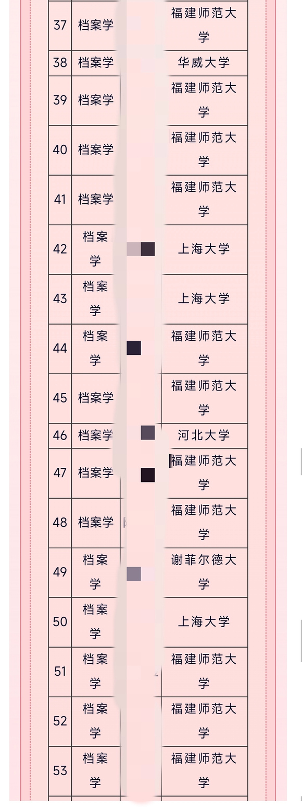

# 社会历史学院详情

[学院官网地址](https://csh.fjnu.edu.cn/main.htm)

> 本详情图书馆学部分由吧友 @上白泽慧音 贡献

## 专业详情

### 图书馆学

#### 开设课程

只包含专业性质课程，2020级版

- 大一上：高数c上，档案学概论
- 大一下：高数c下，数据库技术与运用，数据库技术与应用实验，c语言程序设计，文书学，大学语文，公文写作
- 大二上：大数据管理导论，信息检索，信息检索实验，档案管理学，文献保护学
- 大二下：档案数据化建设，档案数据化建设实验，档案信息资源开发利用，电子文件管理，档案信息检索，档案信息检索实验，信息传播学
- 大三上：图书馆学基础，中国档案事业史，科技档案管理学，信息管理导论，专业外语
- 大三下：档案文献编纂学，档案文献编转学实验，图书馆管理，数字档案馆原理及应用，管理信息系统，管理信息系统实验，计算机网络基础，企业档案管理，外国档案事业史
- 大四实习➕论文无课

> P.S.: 
> 有挂科风险的目测只有高数和c语言，其他突击就OK
> 22级，23级图书档案学高数d，大一上学期 

#### 升学

考研+境外升学14/50 主要为本校本专业
保研3/50 去向均为上海大学

升学率34%

#### 就业

就业率不好透露，有意请私信询问，只有整个学院的，没有单个专业的

下图为2023届就业去向，不确定是否有美化

> 进私企男比女吃香，因为男的太少了
> 薪资应该不咋样，川大档案据传本科5-6k
> 不想进体制的不建议报
> 档案外包公司工作都很简单机械重复，打码录入这种，和正式员工交流了一下，工资也不高，在成都三四千，而且外包公司的人员一般都不需要本科学历的，档案外包最好考个研，但是工资也不高，而且做项目挺累的
> 可以关注gzh图情招聘看看

#### 考公考编

竞争比较小，23和24国考各上岸一人，省考与事业考未收集到数据（←主战场还是这俩）

下图为岗位节选，严格限制图书档案类/档案学

图1为24国考

图2为24福建省考

图3为24福建事业考

分数是比较低的，意向考公考编的同学可以参考

> 想看更多可以下公考雷达看，会员不要开，咸鱼一块钱可以租一天
> 只报图书档案小类不可能分到乡镇，因为图书馆档案馆最低就到县级
> 要考的话本科考就行了，没必要读研，d员不是必需，但是最好是t员

#### 推荐关注的公众号

- 中国档案报
- 图情招聘
- 图书情报专硕圈
- 图情考研日志
- 图本拾光
- 苏州市工商档案管理中心
- RUC信息资源管理学院
- 图书情报研究