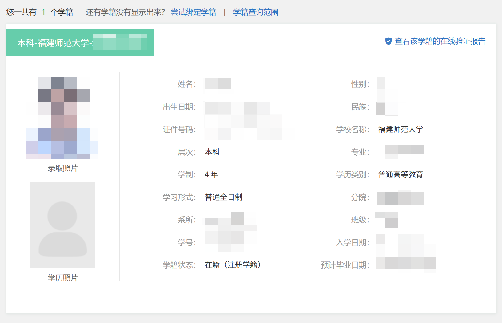

# 行政服务和费用缴纳

## 校园卡办理与使用 {#student-id-card}

**注意：这里说的校园卡是用于食堂消费或门禁的卡。[流量卡请点击此处](../service/network.md#campus-sim-card)**

学校官方意义上的校园卡会在新生报到时发放，校园卡正面有“福建师范大学校园卡”标志，背面印有学生照片、姓名、学号及所属学院。

校园卡可以用于刷学校门禁，也可以通过 福 Star APP 进行储值，在食堂刷卡消费。但是通常并不刷卡，在校园卡功能处绑定微信/支付宝后可以用微信/支付宝直接消费。

校园卡应当保管好，理工科学生做大学物理实验时需要刷卡签到。

校园卡丢失后，需要在学生服务中心（桂苑 5 号楼旁边一楼大厅）进行挂失补办，补办价格为 20 元/张。

## 费用缴纳 {#fee-payment}

!!! tip "提示"
    宿舍水电费每月一结算（暑假为两月一结算），全宿舍一起算，使用工商银行卡缴费。具体信息见[水电缴费](../live/living.md#utility-payment)。此处介绍的是学费/住宿费/代办费缴纳。

学生缴费项目包括学费、住宿费和代办费（仅新生）。具体的收费标准可以 [点击此处](https://cwc.fjnu.edu.cn/xxgk_15751/list.htm) 查看。

在以下方式中选择其中一种（或多种）进行缴费即可。学费、住宿费等缴交完毕后，待 15 个工作日可通过微信小程序搜索“电子票夹”，按步骤领取发票，并自行下载打印。电子票夹取票方法可 [点击此处获取](https://cwc.fjnu.edu.cn/26/70/c15759a403056/page.psp) （本页面仅允许校园网环境访问，若需要在校外访问请使用 [校园VPN](./network.md#campus-vpn)）。

### 一、网上缴费

1. 打开 [网上缴费平台](https://cwcwsjf.fjnu.edu.cn/payment/login2.jsp) 并登录。
2. 核对信息后勾选需要缴费的项目。
3. 确认无误后，点击【支付】进行缴费。支持建行网银支付/微信支付/支付宝支付。

### 二、银行代扣

学校将在每年开学前的特定时间（2025 学年参考时间：8 月 20 日及 8 月 26 日）委托中国建设银行据实划扣应缴款项。学生在完成银行卡片激活后，可及时将学费和住宿费足额存入学校财务系统登记的建行卡中（需保证银行扣款后余额不小于 10 元）。

1. 在代扣前，建行将会发送授权扣款的签约短信，学生需要进行确认回复（若不采用本方式进行缴费，可以不回复）。
2. 授权扣款后，将由建行直接从卡中划扣学费及住宿费。划扣的金额为学费及住宿费的总额，待财务处核算完毕后，多划扣的费用会原路退回（但这一流程大约需要一个月）。

### 三、财务处现场缴费

开学后，未缴费学生可携带银行卡到财务处服务大厅，通过 POS 机现场刷卡缴费。

### 四、生源地助学贷款缴费

成功办理助学贷款的学生，在助学贷款到账后会立即被学校财务处全额划扣走，待财务处完成学费等相关结算（大约需要一个月）后退回剩余部分至 **学校统一发放的建行卡** （可以使用非学校统一发放、自行办理的建行卡，待开学后会进行卡号信息收集工作）中。贷款金额无法覆盖学费及住宿费的需要通过其它缴费渠道补交差额。

## 成绩单及电子证明 {#transcript}

### 本科生成绩单

本科生成绩单包含了学生基本信息、当前已修读课程及分数、已获得学分数及平均学分绩点等。本科生成绩单可以通过以下方式下载：

1. 登录 [可信电子凭证系统](https://dzzm.fjnu.edu.cn)。
2. 选择【成绩单】，在二级界面可选【中文成绩单】或【英文成绩单】。
3. 此时即可查看预览。确认无误后点击【确认】，输入自己的邮箱账号后点击【提交】。
4. 相关证明 PDF 会以邮件附件的形式发送至相应邮箱。所下载的 PDF 已经过数字签名，直接打印即可。若需要加盖学院公章，请咨询相应学院辅导员。

### 成绩等级证明

成绩等级证明用于表示本校的绩点规则及学分绩点(GPA)计算方式为 5 学分制，不涉及个人信息。
本科生成绩等级证明可以通过以下方式下载：

1. 登录 [可信电子凭证系统](https://dzzm.fjnu.edu.cn)。
2. 选择【成绩单】，在二级界面可选【中文成绩等级证明】或【英文成绩等级证明】。
3. 此时即可查看预览。确认无误后点击【确认】，输入自己的邮箱账号后点击【提交】。
4. 相关证明 PDF 会以邮件附件的形式发送至相应邮箱。所下载的 PDF 已经过数字签名，直接打印即可。

### 在学证明/预计毕业证明

在学证明用于表明学生当前正常在学校就读，预计毕业证明用于表明学生正常情况下可于特定时间毕业。
本科生在学证明/预计毕业证明可以通过以下方式下载：

1. 登录 [可信电子凭证系统](https://dzzm.fjnu.edu.cn)。
2. 选择【在学证明】或【预计毕业证明】，在二级界面可选【中文】或【英文】。
3. 此时即可查看预览。确认无误后点击【确认】，输入自己的邮箱账号后点击【提交】。
4. 相关证明 PDF 会以邮件附件的形式发送至相应邮箱。所下载的 PDF 已经过数字签名，直接打印即可。

### 英文授课证明（仅限中英合办专业学生）

中英合办专业学生可以申请英文授课证明，但具体规则不详，可以联系辅导员进行了解。

## 贫困生资助政策 {#financial-aid-policy}

### 学费缓缴绿色通道

对于有办理生源地助学贷款的学生，学校在新生报道时提供了绿色通道，允许学费、住宿费在一定时间段内缓交。

### 生源地助学贷款

邮储、农信、国开行提供贷款，最高 20000 元/年（研究生为 25000 元/年），在校期间的利息由国家财政承担（若攻读研究生则可续期），毕业后分期付款。生源地助学贷款会在拨款后直接划扣到学校账户，待财务处结清学费、住宿费的份额后将剩余的款项进行返还（一般为 1 个月）。

### 勤工俭学岗位

学校提供勤工俭学岗位，如辅导员助理、图书馆接待、行政文职等（优先考虑贫困生），能为贫困生提供一定程度的生活上的保障。

### 国家助学金

努力学习，贫困生每年会有国家助学金：普通困难一年 2800，特别困难一年 4500（需要获得奖学金），因此好好学习也是重要的一环。学习改变命运，你现在的付出的每一分努力，都会在未来给你的美好生活创造一分希望。

### 社会助学金

此外，还有社会助学金。一般有名额限制，分给一个学院的一般一两个，需进行班级评议，年级评议后申请。特别困难还能申请学费减半，无名额限制，需要进行评议，有返乡路费（需申请）。此外，录取通知书中的任何材料都要认真阅读。人间有爱，中国人最大的美德就是团结，困难总会过去的。

### 学费减免

以 [《关于做好2024-2025学年本科学生减免学费的通知》](https://stu.fjnu.edu.cn/51/22/c5950a413986/page.htm) 作为参考，满足条件的学生可以申请学费减免。申请程序大致在每年 4 月左右进行，在可以进行申报时年级会下发通知，可以注意一下。

#### 申请对象

具有我校本部正式学籍的全日制本科学生，且本学年被认定为家庭经济特别困难等级者。

#### 申请条件

1. 家庭经济特别困难且符合下列情况之一者，可申请学费全免：

    1. 父母双亡或由社会福利院抚养长大，且无经济来源的孤儿；
    2. 本人罹患癌症、白血病等重大疾病者。

2. 家庭经济特别困难且符合下列情况之一者，可申请减免学费的50%：

    1. 父母一方已故，需社会救济者；
    2. 父母双方或一方为残疾人或学生本人为残疾学生（需持有中国残联统一制发的《中华人民共和国残疾人证》）；
    3. 家庭遭受重大灾害或重大变故，需社会救济者；
    4. 烈士或荣誉军人子女；
    5. 其他符合国家政策性减免学费条件的学生。

3. 西藏籍免补专业学生及新疆籍内地高中班毕业生减免学费工作,根据相关文件要求执行。
4. 应征入伍的在校生、毕业生、复学生和考录生学费资助或补偿政策，根据相关文件要求执行。

### 受灾资助

当遇到天灾（如洪水）、大型地震等情况时，学校会收集相关受灾学生的信息，给予适当的经济帮助。灾难无情，人间有爱，社会总会帮助你度过难关。

## 学号规则 {#id-format}

我校学号采用一定的规则制定（类似身份证号），在你入学时即确定，不再更改（预科生、复读重考本校除外）。本部分介绍了学号的制定规则，以供参考。

### 本科生学号

本科生学号为 12 位纯数字，规则如下：

- 第 1 位：高考统考生为 1，港澳台生为 6。
- 第 2\~3 位：学院代码，在教务系统中可以进行查询。
- 第 4\~5 位：专业代码，在教务系统中可以进行查询。
- 第 6\~9 位：入学年级。
- 第 10\~12 位：个人编号。本编号为随机排位生成，与高考成绩、生源地等无关。

### 研究生（硕士、博士）学号

研究生学号为 3 位英文字母 加 8 位纯数字，规则如下：

- 第 1 位：全日制为 Q，非全日制为 F。
- 第 2 位：硕士为 S，博士为 B。
- 第 3 位：专硕为 Z，学硕为 X。
- 第 4\~7 位：入学年级。
- 第 8\~11 位：个人编号。

### 教职工职工号

教职工职工号为 6 位纯数字，具体生成规则未知。已知本校单位（教职工、辅导员等）为 0 开头，下属单位和关联单位（如协和学院、附属幼儿园、附属小学、附属中学、资产经营公司、后勤管理处）为 7 开头。

测试部门的工号不固定长度，为 JZG 开头。

## 预科生 {#preparatory-students}

预科生为师大的一种特殊专业，全称为 `少数民族预科班` ，仅招收少数民族考生。预科生在被录取后会在仓山校区学习一年通识课程，完成预科转正（根据兴趣和成绩进行专业分流，计划独立）后重新下发录取通知书，之后相当于统招被录取。

### 招生省份

2025 年，预科生招生省份为广西、贵州、新疆、云南。

## 学信网 {#chsi}

[学信网官网，点击进入](https://www.chsi.com.cn/)

学信网的全称为 `中国高等教育学生信息网` ，是由教育部运营的高等教育学生信息网站，是教育部学历查询网站、教育部高校招生阳光工程指定网站、全国硕士研究生招生报名和调剂指定网站。总而言之，学信网是学生查看自己学籍、验证学历真假、获取火车票/各景区学生优惠的有力证明。

如果你在高中时报考过强基计划，那你应该已经了解了学信网的作用。新生的学籍大约在入学当年的 10 月份才会被录入到学信网中，届时可以通过学信网-学信档案查询到自己的学籍信息。

`国家大学生就业服务平台` 依托学信网的数据提供了"师兄师姐去哪儿"的功能，通过此功能可以了解本校本专业的就业去向情况，包括各个就业去向及其占比、就业单位行业及其占比、就业单位性质及其占比、就业单位 TOP10、就业地区分布。[点击进入](https://www.ncss.cn/student/m/sxsj/index.html)
